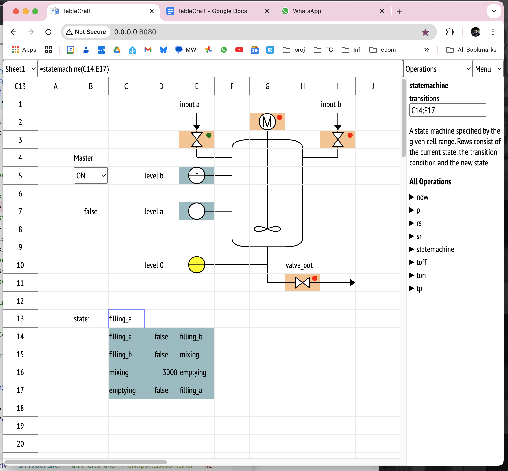

# TableCraft

TableCraft aims to be a simple crafting table for PI-based IoT projects -- 
basically a low-code software pendant to breadboards.

The basic idea is to use a spreadsheet interface to observe input pins "live" 
and to compute values for output pins.

### Why spreadsheets? 

- Spreadsheets are easy to understand 
- Spreadsheets make it easy to observe values live without explicit "print" statements
- The fixed table structure with 2:1 cells makes it easy to visualize processes using simple block graphics -- 
  similar to Mosaic Control or Mimic Panels.
- "Real" PLCs are typically programmed using graphical languages with a similar level of expressiveness,
  so tables seem to be "good enough" for a variety of use cases.

### Current Features 

- Web-based spreadsheet interface suitable for local or remote usage without the need of a "deployment" step
- Digital Input Ports support
- Digital Output Ports support
- PWM Input Ports support
- Table-Defined State Machines
- REST/JSON output 
- Flip-Flop and timed operations such as sr, toff, ton, tp -- known from PLC programming.

### Planned Features

- [PiXtend PLC](https://www.pixtend.com/) Support

### Feature Ideas 

- ST export
- Arduino C-Code export

### Installation

The project is still under development and currently not in a state suitable for end users. 

If one would like to experiment with this, the only way is to check out the project 
from GitHub on a PI and use IntelliJ or "gradle run" to start the server.

This should improve in the future.